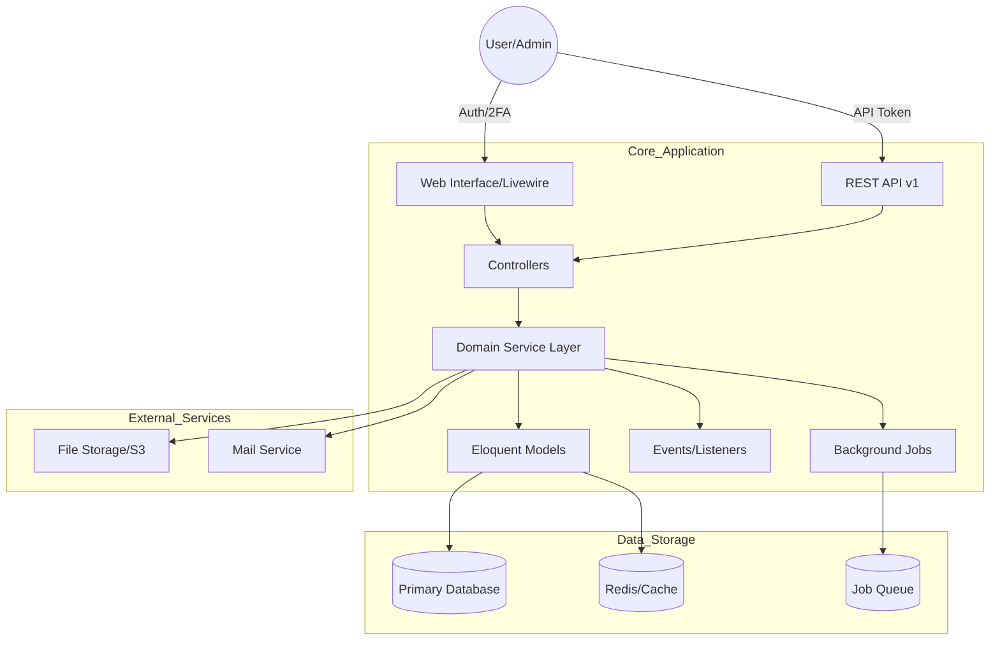

## 


<center>

# Lumexa

</center>

[](https://www.php.net/)
[](https://laravel.com/)
[](https://tailwindcss.com/)
[](https://phpunit.de/)
[](https://laravel.com/)


## Table of contents

- [Introduction](#introduction)
- [Core Features](#core-features)
- [Requirements](#requirements)
- [Installation](#installation)
- [Docker Setup](#docker-setup)
- [Architecture](#architecture)
- [Dependencies](#dependencies)
- [Technologies](#technologies)
- [API Documentation](#api-documentation)
- [Stable tests](#stable-tests)
- [Tests Login](#tests-login)

## Introduction

Lumexa is a SaaS application that allows multiple companies to use the same system while keeping their data separate.

### The Problem
Small to medium-sized businesses often struggle with "data sprawl"—using multiple disconnected tools for leads, team management, and internal operations. This leads to security risks, data silos, and high subscription costs.

### The Solution
Lumexa provides a unified, **multi-tenant ecosystem** where companies can securely manage their entire lifecycle—from lead acquisition via Excel imports to team collaboration—all within a single, high-performance platform.

## Core Features

### Authentication & Security

- **Multi-factor authentication (2FA)** – Secure login with TOTP via Laravel Fortify
- **Role-based access control** – Three roles: Super Admin, Admin, and User
- **Email verification** – Email confirmation for user accounts
- **Password reset** – Secure password recovery flow

### Multi-Tenancy

- **Multi-company support** – Users can work with multiple companies, each with isolated data
- **Company workspace** – Each company has its own workspace and management area
- **User invitations** – Invite new members to companies

### Lead Management

- **Lead CRUD** – Create, read, update, delete leads
- **Lead lists** – Individual contacts within leads
- **Lead status workflow** – Pending, Process, Cleaned, Blocked, Approved, Rejected
- **Excel import** – Bulk import leads via Excel/CSV files

### API & Integrations

- **REST API** – JSON API for external integrations (`/api/v1`)
- **API Resources** – Consistent JSON response formatting
- **Rate limiting** – 60 requests/minute per IP
- **Laravel Sanctum** – Token-based authentication ready

### Performance & Scalability

- **Dashboard caching** – 5-minute cache for statistics
- **Background jobs** – Queue processing for heavy tasks
- **Event-driven** – Laravel Events & Listeners for decoupling

### Activity & Logging

- **Activity tracking** – Full audit trail with Spatie ActivityLog
- **System logging** – Comprehensive activity logging

## Requirements

- PHP 8.4+ - [Download PHP](https://www.php.net/downloads.php)
- Composer - [Get composer](https://getcomposer.org)
- Bun - [Install Bun](https://bun.sh)
- MySQL 8.0 or SQLite

## Installation

```bash
git clone https://github.com/saeedhosan/lumexa.git
cd lumexa

#1. Setup project
composer setup

#2. Start the development server
composer dev
# visit: http://localhost:8000

# Build assets for production
npm run build
```

## Docker Setup

> Requires [Docker Desktop](https://www.docker.com/products/docker-desktop/)

```bash
cp .env.example .env
docker compose up -d
```

Open http://localhost:8080 — done!

```bash
docker compose down        # stop
docker compose restart     # restart
docker compose exec app bash # enter container

## Get demo data for testing
docker compose exec app php artisan migrate:fresh --seed
```

## Architecture

Lumexa follows a clean Laravel architecture with a **Domain-Driven Service Layer** pattern to ensure the codebase remains maintainable as the product scales.

### System Architecture Diagram


### Technical Decisions & Trade-offs

| Decision | Choice | Rationale |
| :--- | :--- | :--- |
| **Multi-Tenancy** | Single Database | Chosen for cost-efficiency and easier maintenance for a mid-market SaaS. Data isolation is strictly enforced via Global Scopes. |
| **Auth Backend** | Laravel Fortify | Prioritized security-first development by using a battle-tested, headless auth engine with native 2FA support. |
| **Frontend** | Livewire + Flux UI | Opted for "The TALL Stack" to achieve SPA-like reactivity without the complexity of a separate JS framework, reducing "Time to Market". |
| **Testing** | Pest PHP | Implemented 160+ tests using Pest for its superior readability and developer velocity, ensuring a stable production environment. |
| **Import Engine** | Maatwebsite Excel | Used a robust library for lead imports to handle complex CSV/Excel edge cases and prevent CSV Injection attacks. |

**Route Structure:**

- `/` - Public landing page
- `/api/v1/*` - REST API endpoints
- `/app/*` - User dashboard and features
- `/admin/*` - Company administration
- `/settings/*` - User profile settings
- `/settings/*` - User profile settings

## Dependencies

| Package           | Version | Purpose                   |
| ----------------- | ------- | ------------------------- |
| laravel/fortify   | 1.36.1  | Authentication backend    |
| livewire/flux     | 2.13.0  | UI component library      |
| livewire/livewire | 4.2.1   | Reactive PHP components   |
| laravel/boost     | 2.3.4   | MCP server & dev tools    |
| pestphp/pest      | 4.4.3   | Testing framework         |
| tailwindcss       | 4.2.0   | CSS framework             |
| maatwebsite/excel | ^3.1    | Excel exports and imports |

## Technologies

- **Backend:** PHP 8.4, Laravel 13
- **Frontend:** Blade templates, TailwindCSS 4, Flux UI
- **Database:** SQLite (default), MySQL/PostgreSQL compatible
- **Authentication:** Laravel Fortify with 2FA
- **Testing:** Pest PHP
- **Code Quality:** Laravel Pint, Rector

## Stable tests

Run tests:

```bash
composer test
```

Run lint:

```bash
composer lint
```

## API Documentation

Full API documentation is available in [docs/api.md](/docs/api.md).

**Quick Start:**

```bash
# List leads
curl -X GET "http://localhost:8000/api/v1/leads" \
  -H "Accept: application/json"

# Get single lead
curl -X GET "http://localhost:8000/api/v1/leads/1" \
  -H "Accept: application/json"
```

**Base URL:** `/api/v1`

**Features:**

- RESTful JSON responses via Laravel API Resources
- Pagination support (`per_page` parameter)
- Rate limited (60 requests/minute)
- Event-driven architecture with Laravel Events
- Background job processing with Laravel Queues

## Tests Login

For testing purposes, you can use the demo [users](/config/demo.php) with UserSeeder.php:

```bash
php artisan migrate:fresh --seed
```

User:

```txt
user: user@example.com
pass: demo1234
```

Admin:

```txt
user: admin@example.com
pass: demo1234
```

You can login and access the welcome page at `http://localhost:8000` to visit the dashboard.
