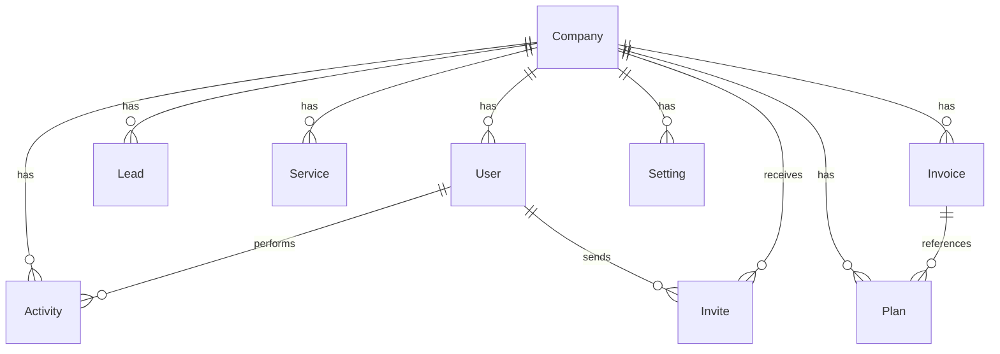

# Lumexa Architecture

## Overview

Lumexa is a multi-tenant SaaS platform for managing companies, users, leads, and billing. Each company operates in its own workspace with isolated data.

```mermaid
graph TB
    subgraph Client
        B[Browser]
        A[API Client]
    end

    subgraph "Web Server"
        LB[Load Balancer]
        subgraph "PHP (Laravel 13)"
            W[Web Routes<br/>Livewire + Flux UI]
            R[REST API Routes<br/>Sanctum Auth]
            H[/health Endpoint]
        end
    end

    subgraph "Services"
        RE[Redis<br/>Cache + Queue]
        M[(MySQL<br/>Database)]
        RV[Laravel Reverb<br/>WebSocket]
    end

    subgraph "External"
        S[Stripe<br/>Billing]
    end

    B --> LB
    A --> LB
    LB --> W
    LB --> R
    LB --> H
    W --> M
    W --> RE
    R --> M
    R --> RE
    W -.-> RV
    R -.-> S
    S -.->|Webhook| R
```

## Tech Stack

| Layer | Technology |
|-------|-----------|
| **Framework** | Laravel 13 (PHP 8.4) |
| **Frontend** | Livewire 4 + Flux UI + Tailwind CSS v4 |
| **Database** | MySQL 8.0 |
| **Cache** | Redis |
| **Queue** | Redis |
| **Real-time** | Laravel Reverb (WebSocket) |
| **Billing** | Stripe (raw SDK) |
| **Auth** | Laravel Fortify + Sanctum |
| **Static Analysis** | PHPStan (level max) |
| **Testing** | Pest 4 (195+ tests) |
| **CI/CD** | GitHub Actions |

## Multi-Tenancy Architecture

### Subdomain Resolution

```
https://{company-slug}.lumexa.com
                    ↓
    CompanyTenantResolver::resolve($request)
                    ↓
    Match subdomain → Find company by slug → Scope all queries
                    ↓
                    ↓ (fallback)
    Route parameter `company_id` → Scope all queries
```

Tenancy is implemented as a **request-scoped service** (`CompanyTenantManager`). It is resolved early in the request lifecycle via middleware and sets the **current company** for the duration of the request.

### Data Isolation

All tenant-scoped tables (`leads`, `services`, `invoices`, `activities`, etc.) include a `company_id` column. Eloquent queries are automatically scoped via middleware or explicit `where` clauses.

### Key Files

| File | Purpose |
|------|---------|
| `app/Tenancy/CompanyTenantManager.php` | Current company resolver/scope management |
| `app/Tenancy/CompanyTenantResolver.php` | Subdomain → company slug matching |

## Domain Model



### Core Entities

| Entity | Description | Key Fields |
|--------|-------------|------------|
| **Company** | Tenant workspace | `slug`, `name`, `is_active`, `stripe_id`, `trial_ends_at` |
| **User** | Platform user (belongs to a company) | `name`, `email`, `type`, `company_id` |
| **Lead** | Sales lead within a company | `name`, `email`, `phone`, `status`, `company_id` |
| **Service** | Billable service offered to leads | `name`, `description`, `price`, `company_id` |
| **Plan** | Subscription plan | `name`, `price`, `interval`, `features` |
| **Invoice** | Billed invoice for a company | `amount`, `status`, `stripe_invoice_id`, `company_id` |

## API Design

### Versioning

All REST API routes are prefixed with `/api/v1/`.

### Authentication

API uses **Laravel Sanctum** token-based auth. Tokens are passed via `Authorization: Bearer <token>` header.

### Endpoints

| Method | Endpoint | Auth | Description |
|--------|----------|------|-------------|
| GET | `/api/v1/leads` | Sanctum | List leads |
| POST | `/api/v1/leads` | Sanctum | Create lead |
| GET | `/api/v1/leads/{lead}` | Sanctum | Get lead |
| PUT | `/api/v1/leads/{lead}` | Sanctum | Update lead |
| DELETE | `/api/v1/leads/{lead}` | Sanctum | Delete lead |
| GET | `/api/v1/companies` | Sanctum | List companies |
| POST | `/api/v1/companies` | Sanctum | Create company |
| GET | `/api/v1/companies/{company}` | Sanctum | Get company |
| PUT | `/api/v1/companies/{company}` | Sanctum | Update company |
| DELETE | `/api/v1/companies/{company}` | Sanctum | Delete company |
| GET | `/api/v1/services` | Sanctum | List services |
| GET | `/api/v1/services/{service}` | Sanctum | Get service |
| POST | `/api/stripe/webhook` | None | Stripe webhook |
| GET | `/health` | None | Health check |

API documentation is auto-generated at `/docs/api`.

## Frontend Architecture

### Component Structure

```
resources/views/
├── livewire/
│   ├── admin/       # Admin panel components
│   ├── app/         # Application components
│   └── auth/        # Authentication components
├── components/      # Flux UI + Blade components
└── layouts/         # Page layouts
```

- **Livewire 4** for reactive server-side components
- **Flux UI** component library for consistent UI
- **Tailwind CSS v4** for utility-first styling
- **Alpine.js** for client-side interactivity
- **Laravel Echo** for Reverb WebSocket subscriptions

### Real-time Updates

Lead creation broadcasts via Reverb to `private-company.{companyId}` channel, allowing live UI updates without polling.

## Billing

Billing is handled via the raw Stripe SDK (`stripe/stripe-php`):

```
POST /api/stripe/webhook
    → HandleStripeWebhook action
    → Updates company stripe_id, subscription status
    → Creates invoice records locally
```

## Deployment

- **Container**: `webdevops/php-nginx:8.4-alpine`
- **Orchestration**: `docker compose up`
- **CI**: GitHub Actions (tests, lint, PHPStan, load test)
- **Live demo**: [https://lumexa.saeedhosan.com](https://lumexa.saeedhosan.com)

## Monitoring

| Endpoint | Purpose |
|----------|---------|
| `GET /health` | Returns DB + cache status in JSON |

## ADRs

Architecture Decision Records are in `docs/adr/`:

- `001-multi-tenancy.md` — Row-level tenancy over separate databases
- `002-frontend-architecture.md` — Livewire + Flux UI over Inertia/SPA
- `003-custom-tenancy.md` — Custom tenancy implementation over packages
